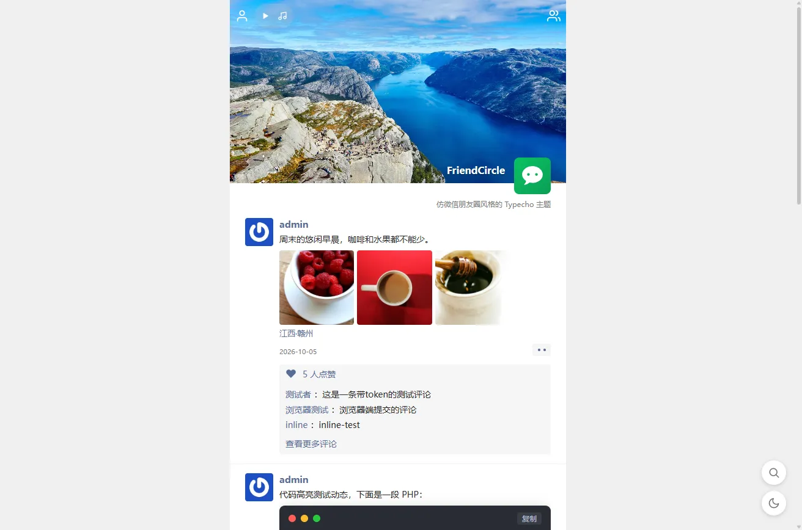

# FriendCircle

一款仿微信朋友圈风格的 Typecho 主题：时间线式动态列表 + 九宫格图片 + 内联点赞评论，界面简洁，交互还原朋友圈手感。

## 特性

- **朋友圈式动态流**：封面大图、头像昵称、个性签名、动态卡片（时间 / 位置 / 九宫格图片），长文自动折叠并跳转详情页
- **内联评论**：无需跳转详情页即可在卡片内发表 / 回复评论；支持 OwO 表情面板、评论者头像、输入框自适应高度、空态提示；点击他人评论快速回复
- **点赞可取消**：再次点击取消点赞，状态记忆在浏览器本地，防连点保护
- **详情页**：完整评论列表 + 评论窗口按需展开；Prism 代码高亮（One Dark 式样、行号、一键复制、代码语言自动识别）
- **明暗双主题**：手动切换 + 跟随系统偏好，记忆在 `localStorage`；`<html data-theme="dark">` 统一挂载
- **访问统计**：站点级访客统计条（今日 / 昨日 / 总访问，悬停气泡展示近 7 天 / 30 天），IP + UA 指纹同日去重、爬虫不计入，支持 JSON 接口轮询自动刷新与时区配置，MySQL / SQLite 双兼容，首次访问自动建表
- **音乐播放器**：后台配置背景音乐（支持多条随机轮播），顶栏迷你播放器（播放 / 暂停、歌名、跳动音柱）
- **友情链接**：后台配置友链列表，顶栏入口弹窗展示（「联系人」风格）
- **搜索**：悬浮按钮弹出搜索条（回车提交，走 Typecho 原生搜索归档）
- **悬浮按钮组**：返回顶部（滚动后出现，平滑回顶）、搜索、明暗切换
- **AJAX 无限加载**：下拉自动加载下一页，链式补载，失败点击重试；新卡片内播放器 / 代码块自动初始化
- **图片灯箱**：卡片图片与正文图片点击放大，原生实现无第三方依赖
- **响应式设计**：适配桌面端与移动端

## 环境要求

- Typecho 1.2+（基于 1.3 开发验证）
- PHP 7.3+（已在 7.3 / 8.0 双版本下通过语法与功能验证）

## 安装

1. 下载主题并解压到 `usr/themes/` 目录，文件夹名保持 `FriendCircle`
2. 登录 Typecho 后台 → 控制台 → 外观
3. 启用「FriendCircle」主题
4. 进入主题设置按需配置（封面、头像、昵称、背景音乐、友情链接、访问统计等）

## 推荐插件

- **[VideoCollector](https://github.com/imxiaoxp/VideoCollector)**：视频采集插件——在 Typecho 后台从苹果 CMS 标准采集 API 搜索影视资源，一键生成 `[play]` 短代码嵌入多分集视频播放器（ArtPlayer / Iframe 双播放模式）；即使不使用采集功能，也可以用短代码插入视频。主题已适配：首页卡片提取第一个播放器（去除分集按钮）直接播放，详情页按原生 Typecho 渲染完整播放器；全局媒体互斥：任一媒体开始播放时，其它播放器与顶栏背景音乐自动暂停（跨域 iframe 内的媒体除外）。
- **[APlayer-Typecho](https://github.com/MoePlayer/APlayer-Typecho)**：音乐播放插件——通过编辑器音乐按钮或 `[Meting]` 短代码插入网易云 / QQ 音乐等平台的单曲、专辑、歌单，也支持 `[Music]` 直链自定义歌曲（`title` / `author` / `url` / `pic` / `lrc` 属性）（下载后需将插件文件夹改名为 `Meting`）。主题已适配：文章插入音乐后，首页卡片与详情页直接展示 APlayer 播放器，AJAX 加载新卡片自动初始化，完整支持主题暗色模式；全局媒体互斥：任一媒体开始播放时，其它播放器与顶栏背景音乐自动暂停。

## 后台设置说明

| 设置项 | 说明 |
| --- | --- |
| 封面图片 / 视频 URL | 顶部封面大图，填 mp4/webm 等视频地址时作为静音循环背景播放（不受媒体互斥影响），留空显示纯色渐变 |
| 封面类型 | 自动识别（按扩展名）/ 视频 / 图片；地址为无扩展名的跳转链接（如 302 到视频文件）时选「视频」 |
| 头像 URL 或邮箱 | 填图片地址，或填邮箱按「头像源」获取 |
| 头像源 | lty / cravatar / weavatar / loli / gravatar |
| 昵称 | 留空使用站点标题 |
| 个性签名 | 显示在头像下方，可留空 |
| 暗色模式 | 跟随系统并允许切换 / 仅亮色 / 仅暗色 |
| PJAX 无刷新跳转 | 站内点击不整页刷新，自动重载 APlayer / VideoCollector 播放器与代码高亮，背景音乐跨页持续播放 |
| PJAX 自定义重载函数 | 每行一条 JS 语句，PJAX 切页完成后在内置插件重载之后依次执行，用于重载其它插件的组件；空行与 `//` 注释行跳过，留空不执行 |
| 动态内联评论数 | 首页每条动态展示的最新评论条数，默认 3 |
| 背景音乐 | 每行一条：`音乐地址\|歌名`（歌名可省略），保存后顶栏显示播放器 |
| 友情链接 | 每行一条：`名称\|地址\|头像地址`（头像可省略），保存后顶栏显示友链入口 |
| 访问统计 | 开关 + 位置（视口四角悬浮）+ 自动刷新间隔 + 统计时区 |

## 文章发布约定

- 发布动态使用「文章」，内容支持 Markdown；图片自动提取到卡片九宫格（最多 9 张）
- 编辑文章的自定义字段「所在位置」填写地理位置（如 `江西·赣州`），显示在动态正文下方
- 正文中的代码块（``` 围栏）会自动高亮，语言可标注也可自动识别
- 适配插件：[VideoCollector](https://github.com/imxiaoxp/VideoCollector)（视频播放器）、APlayer-Typecho / Meting（音乐播放器），首页卡片与详情页均会提取并渲染播放器

## 目录结构

主题文件平铺在根目录，可在 Typecho 后台「控制台 → 外观 → 编辑」中直接编辑。

```
FriendCircle/
├── functions.php        # 主题设置、动态渲染、社交数据缓存、访问统计等服务端逻辑
├── comments.php         # 评论渲染与查询函数集（由 functions.php 加载）
├── comments-ajax.php    # 评论 AJAX 接口（列表片段 / 提交）
├── like.php             # 点赞 AJAX 接口
├── index.php            # 首页 / 归档页（搜索、分类、标签、作者）动态列表
├── post.php             # 详情页
├── page.php             # 独立页面
├── header.php           # 页头（暗色初始化、Prism CDN、顶栏）
├── footer.php           # 页尾（悬浮按钮组、友链 / 搜索弹窗、统计条、脚本）
├── style.css            # 全部样式源文件（含暗色模式与插件适配），页面实际加载 style.min.css
├── style.min.css        # style.css 压缩产物（由 header.php 引用）
├── app.js               # 前端交互源文件（评论 / 点赞 / 加载 / 弹窗 / 统计等），页面实际加载 app.min.js
├── app.min.js           # app.js 压缩产物（由 footer.php 引用）
├── OwO.json             # OwO 表情码表
└── assets/
    └── img/             # 主题默认图片（封面、默认头像）
```

## 维护说明

- `app.js` 与 `style.css` 是源文件，供后期修改；页面实际引用压缩产物 `app.min.js` / `style.min.css`
- 修改源文件后需重新压缩（本机需 Node.js）：

```bash
npx esbuild app.js --minify --outfile=app.min.js
npx esbuild style.css --minify --outfile=style.min.css
```

## 许可证

GPL v3.0
